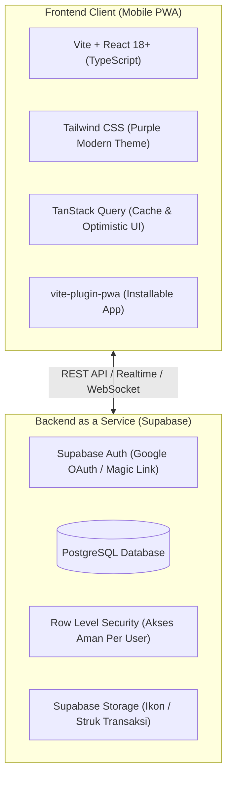

# 🧭 Development Walkthrough — Financial Tracker V2

Dokumen ini adalah panduan lengkap dan roadmap implementasi untuk membangun **Financial Tracker V2** menggunakan **Vite + React + TypeScript + Tailwind CSS** dan **Supabase (PostgreSQL)**.

---

## 1. Mengapa Arsitektur Baru? (V1 vs V2)

| Fitur / Masalah | Versi 1 (Google Sheets + Apps Script) | Versi 2 (Vite + React + Supabase) |
|---|---|---|
| **Kecepatan Input** | 2–4 detik (cold start GAS, redirect HTTP) | **Instan (< 100 ms)** |
| **Keandalan Backend** | Sering error CORS / HTML login page | **REST API resmi Supabase + PostgreSQL ACID** |
| **Riwayat Transaksi** | Tidak ada tampilan riwayat/filter | **Daftar riwayat lengkap, search, pagination** |
| **Edit & Hapus** | Sangat berisiko merusak formula sheet | **Edit & Hapus instan 1 klik via SQL ID** |
| **Analitik & Grafik** | Tergantung formula spreadsheet | **Chart visual (Pie chart kategori, Bar chart bulanan)** |
| **Struktur Kode** | Monolitik 1 file `app.js` (800+ baris) | **Modular per komponen (Atomic Design)** |
| **PWA & Offline** | Cache manual service worker | **Workbox / vite-plugin-pwa terstandarisasi** |

---

## 2. Arsitektur Teknis



---

## 3. Skema Database PostgreSQL (Siap Dijalankan di Supabase)

Jalankan script SQL ini di **SQL Editor** Supabase saat setup:

```sql
-- 1. Enable UUID extension
create extension if not exists "uuid-ossp";

-- 2. TABEL AKUN (Bank, E-Wallet, Kartu Kredit, Cash)
create table public.accounts (
  id uuid primary key default uuid_generate_v4(),
  user_id uuid references auth.users(id) on delete cascade default auth.uid(),
  name text not null,
  type text not null check (type in ('bank', 'ewallet', 'credit', 'cash')),
  account_number text,
  icon_url text,
  color text default '#667eea',
  initial_balance numeric default 0,
  created_at timestamptz default now()
);

-- 3. TABEL KATEGORI
create table public.categories (
  id uuid primary key default uuid_generate_v4(),
  user_id uuid references auth.users(id) on delete cascade default auth.uid(),
  name text not null,
  type text not null check (type in ('pengeluaran', 'pemasukan')),
  emoji text default '💰',
  monthly_budget numeric default 0,
  created_at timestamptz default now()
);

-- 4. TABEL TRANSAKSI
create table public.transactions (
  id uuid primary key default uuid_generate_v4(),
  user_id uuid references auth.users(id) on delete cascade default auth.uid(),
  date date not null default current_date,
  type text not null check (type in ('pengeluaran', 'pemasukan', 'transfer')),
  amount numeric not null check (amount > 0),
  source_account_id uuid references public.accounts(id) on delete set null,
  destination_account_id uuid references public.accounts(id) on delete set null,
  category_id uuid references public.categories(id) on delete set null,
  notes text default '',
  created_at timestamptz default now()
);

-- 5. ROW LEVEL SECURITY (RLS) - Data hanya bisa diakses pemilik akun
alter table public.accounts enable row level security;
alter table public.categories enable row level security;
alter table public.transactions enable row level security;

create policy "User can view own accounts" on public.accounts for all using (auth.uid() = user_id);
create policy "User can view own categories" on public.categories for all using (auth.uid() = user_id);
create policy "User can view own transactions" on public.transactions for all using (auth.uid() = user_id);
```

---

## 4. Roadmap Implementasi Bertahap

### 📌 Tahap 1: Inisialisasi Project & Design System
1. Inisialisasi project dengan template `vite-react-ts`:
   ```bash
   npm create vite@latest . -- --template react-ts
   npm install
   ```
2. Install dependensi utama:
   ```bash
   npm install @supabase/supabase-js @tanstack/react-query lucide-react clsx tailwind-merge
   npm install -D tailwindcss postcss autoprefixer vite-plugin-pwa
   npx tailwindcss init -p
   ```
3. Konfigurasi Tailwind dengan palette tema ungu modern yang konsisten dari V1.

### 📌 Tahap 2: Setup Database & Supabase Client
1. Buat project baru gratis di [supabase.com](https://supabase.com).
2. Jalankan skema SQL di atas pada menu **SQL Editor**.
3. Buat file `.env` di root project:
   ```env
   VITE_SUPABASE_URL=https://xxxxxxxxxxxx.supabase.co
   VITE_SUPABASE_ANON_KEY=eyJhbGciOi...
   ```
4. Buat inisialisasi client Supabase di `src/lib/supabase.ts`.

### 📌 Tahap 3: Fitur Utama (Input Transaksi Kilat & Dashboard)
1. **Form Transaksi Mobile-First:**
   - Input nominal besar dengan pemformat Rupiah otomatis.
   - Pilihan tipe: Keluar, Transfer, Masuk.
   - Dropdown Akun (dengan logo/ikon bank Indonesia).
   - Dropdown Kategori dengan emoji.
2. **Tab Saldo & Tagihan:**
   - Ringkasan Total Saldo (Bank & E-Wallet).
   - Ringkasan Total Tagihan (Kartu Kredit & Paylater).
   - Card saldo per akun dengan status positif / negatif.

### 📌 Tahap 4: Riwayat & Manajemen Transaksi
1. **Halaman Riwayat Transaksi:**
   - Pengelompokan transaksi berdasarkan tanggal (Hari Ini, Kemarin, dsb).
   - Filter berdasarkan bulan dan kategori.
   - Pencarian catatan transaksi (*Search bar*).
2. **Modal Edit & Hapus Transaksi:**
   - Pengguna bisa mengoreksi nominal atau menghapus transaksi yang salah catat.

### 📌 Tahap 5: Laporan, Grafik & Budgeting
1. Install charting library ringan:
   ```bash
   npm install recharts
   ```
2. Buat visualisasi:
   - **Pie Chart:** Persentase pengeluaran per kategori.
   - **Bar Chart:** Tren bulanan pemasukan vs pengeluaran.
   - **Budget Progress:** Indikator batas pengeluaran kategori.

### 📌 Tahap 6: Offline Support & Deploy PWA
1. Konfigurasi `vite-plugin-pwa` untuk caching offline penuh.
2. Deploy ke **Vercel** / **Cloudflare Pages** (Gratis, auto-deploy saat git push).

---

## 5. Rencana Migrasi Data dari Google Sheet Lama
Jika ingin memindahkan data lama dari spreadsheet:
1. Di Google Sheets, buka sheet `Main` → **File > Download > Comma Separated Values (.csv)**.
2. Kita bisa menjalankan script import sederhana (`scripts/import-csv.ts`) yang membaca CSV dan memasukkannya ke tabel `transactions` di Supabase.

---

## 6. Struktur Folder yang Direkomendasikan

```
FinancialTrackerV2/
├── .env.example
├── .gitignore
├── DEVELOPMENT_WALKTHROUGH.md
├── README.md
├── index.html
├── package.json
├── src/
│   ├── assets/          # Logo bank & icons
│   ├── components/      # UI components (Button, Modal, Card, Toast)
│   │   ├── forms/       # TransactionForm
│   │   ├── layout/      # Header, BottomNav
│   │   └── ui/          # Primitives
│   ├── features/        # Feature modules
│   │   ├── accounts/    # Saldo & Tagihan
│   │   ├── analytics/   # Laporan & Grafik
│   │   └── history/     # Riwayat transaksi
│   ├── hooks/           # Custom React hooks (useTransactions, useAccounts)
│   ├── lib/             # supabase.ts, formatters.ts
│   ├── types/           # TypeScript interfaces (database.types.ts)
│   ├── App.tsx
│   ├── main.tsx
│   └── index.css
└── vite.config.ts
```
